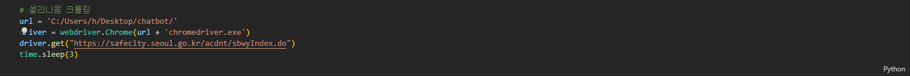
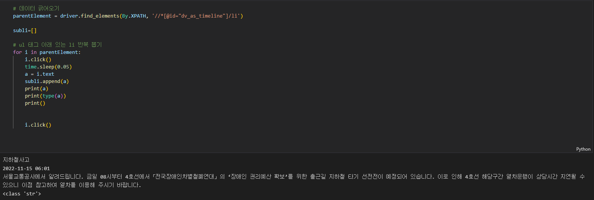
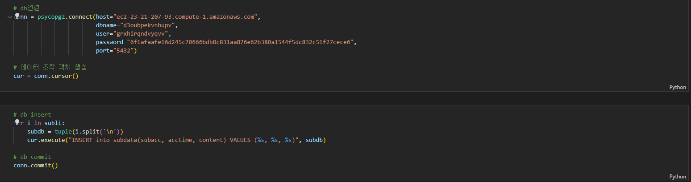
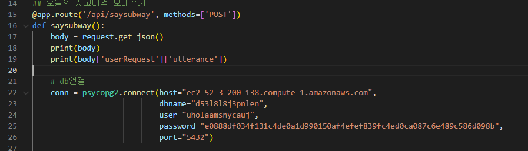

# 휴먼교육센터 챗봇 프로젝트

---

### 22.11.8 ~ 11.11

기획보고기간

---

### 22.11.11 ~ 11.12

heroku 서버설정

---

### 22.11.12 ~ 11.13

API & 크롤링 코드작업

---

### 22.11.13 ~ 11.15

postgreDB 연결

---

### 22.11.15 ~ 
## To Do List:
# 2022.11.16

1. 서울안전누리 사이트 크롤링

2. 서울 안전누리 사이트에서 데이터 긁어 오기

3. 긁어온 데이터 DB에 담기

4. '지하철' 입력시 최신 사건사고 나오게 하는 시나리오 짜기.

asdasd