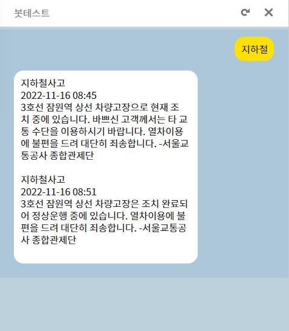
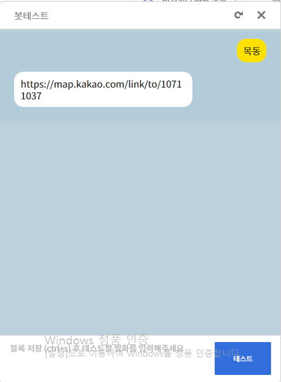
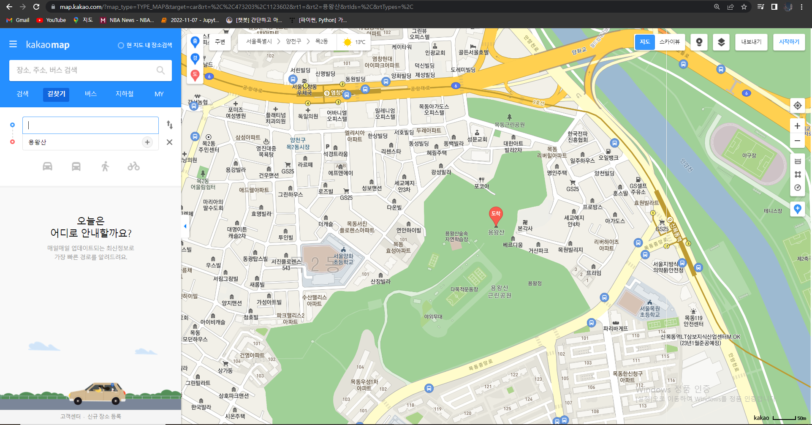

### 22.11.15 ~ 
## To Do List:
# 2022.11.15

1. 서울안전누리 사이트 크롤링

2. 서울 안전누리 사이트에서 데이터 긁어 오기

3. 긁어온 데이터 DB에 담기

4. '지하철' 입력시 최신 사건사고 나오게 하는 시나리오 짜기.

5. 결과  

# 2022.11.15 오늘 코딩의 문제점.
결과 사진을 보면 알 수 있듯이, 지하철 시간별 단락이 구분되어 있지 않아서 가독성이 떨어진다.

# 내일 해야할 것 .
1. 네이버 API 활용하여 뉴스 기사 DB에 저장하기
2. 카카오 API 활용하여 목적지 알려주기.
3. 결과의 문제점 해결 방안 찾고 해결해보기.

# 2022.11.16

1.  지하철 시간별 단락 구분하기

어제 결과 사진과 다르게 시간별 단락을 구분했다.  

2.  카카오 API 활용하여 목적지 알려주기.  

 원하는 장소 검색시 위처럼 카카오링크로 대답.

3. 실시간으로 추가되는 정보들을 중복되지 않게 중복검사.
    - 2개의 컬럼을 가지는 subaccdata를 새로 만듬.
    - 새로 만든 데이터베이스의 컬럼 2개를 복합키로 설정.
        + 이떄 postgre 에서 중복된 데이터를 사전에 예방하여 insert하려면 기본 키가 설정되어야 함.
    - 기존에 있던 subdata 테이블의 데이터를 subaccdata로 옮김.
    - 변경된 테이블에 맞는 insert 코드 세팅
- 결과  

# 2022.11.16 오늘 코딩의 문제점.
카카오 API 활용하여 목적지를 알려주는데 PC로 해당 링크를 클릭할 시,      사진 처럼 출발지 자동 설정이 안됨.
모바일로 해당 링크 접속시 카카오 map 어플과 자동으로 연결하여 출발지가 본인 핸드폰 위치로 설정됨. 그러나 카카오map 이 없을 경우에도 설정되는지는 확인이 필요함.
# 내일 해야할 것.
1. 지하철 속보 알림 자동화 구성하기.
2. 자동으로 메시지 보내는 방법 알아보기.
    - 참조 : https://novice-engineers.tistory.com/9
