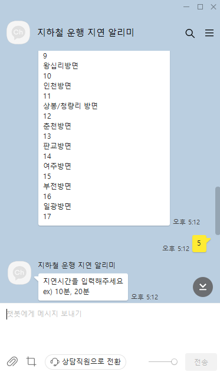
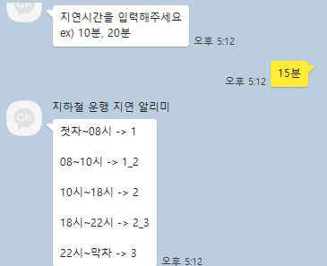
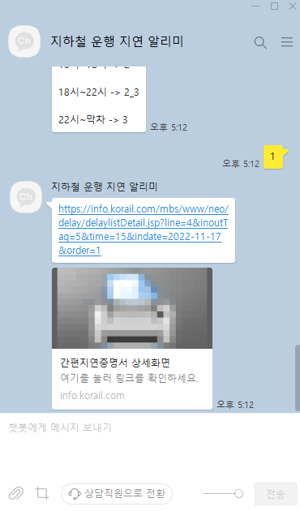
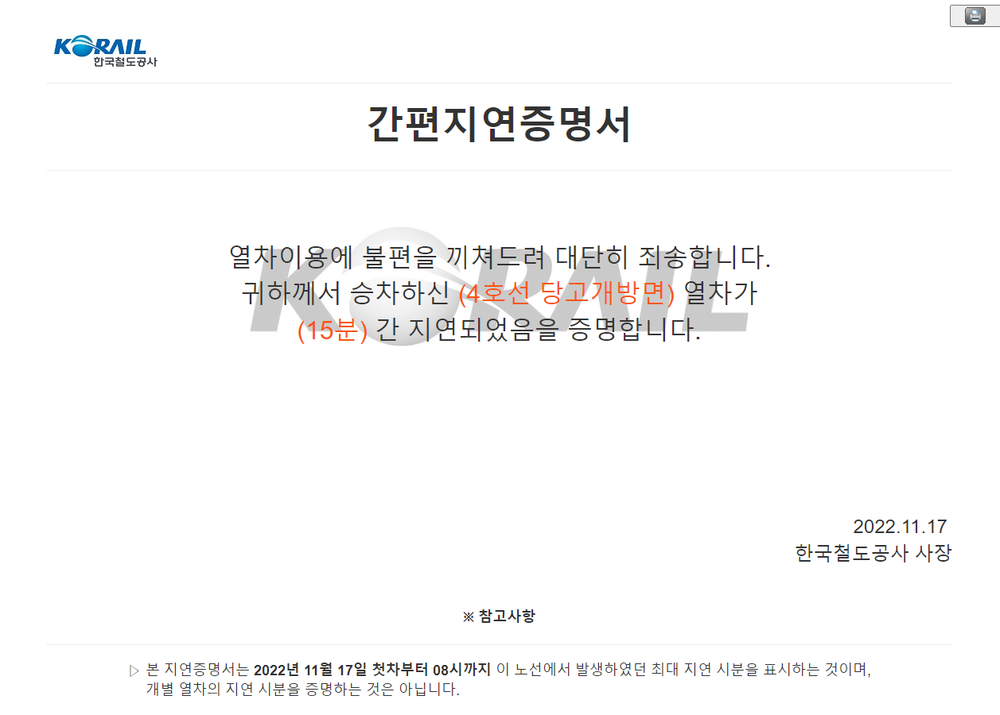

### 2022.11.18
## todolist

1. 카카오 api 이용하여 나에게 메시지 보내기 (황지훈)
<!--  -->
    - 셀레레움 크롤링 통해 지하철 속보 나에기 보내기
 

2. 네이버 뉴스 크롤링후 뉴스 출력 (임여명)
    - 원하는 호선 뉴스 출력
<!--  -->
 

3. 지하철 간편지연증명서 출력 (임여명)
    - 열차 호선, 열차 방면, 지연된 시간, 운행시간을 입력하면 간편지연증명서 링크출력
<!-- , , ,  -->

